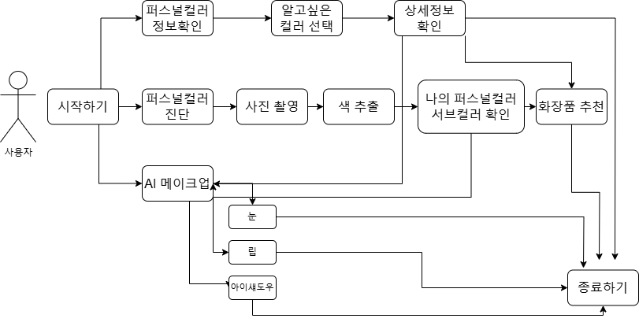
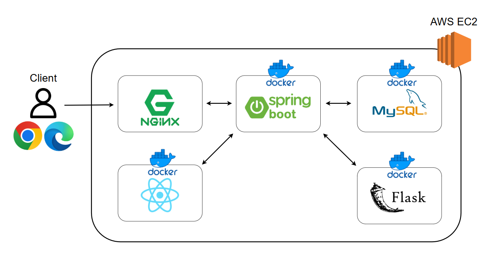

# 너의색깔은? - AI 기반 퍼스널컬러 진단 및 메이크업 시뮬레이션 키오스크  

## 📌 프로젝트 소개  
**"너의색깔은?"**은 AI 기술을 활용하여 사용자의 퍼스널 컬러를 진단하고, 맞춤형 메이크업을 시뮬레이션할 수 있는 키오스크 서비스입니다.  
사용자는 자신의 피부 톤과 어울리는 색상을 확인하고, 가상으로 다양한 메이크업 제품을 적용해볼 수 있습니다.  
진단 결과를 바탕으로 맞춤형 화장품, 스타일링, 향수 추천까지 제공하며, 결과물은 QR 코드 또는 이메일로 저장할 수 있습니다.  

---

## 🎯 주요 기능  

### 🔹 퍼스널 컬러 진단  
- **MobileNetV2 기반 AI 피부 톤 분석**  
- **LAB 색상 거리 기반 진단** (화이트 밸런싱 적용)  
- **AI 모델과 색상 분석 중 사용자가 원하는 방식 선택 가능**  

### 🔹 메이크업 시뮬레이션  
- **Mediapipe를 활용한 얼굴 주요 부위(눈, 코, 입) 좌표 인식**  
- **블러, 채도 조절 가능, 원본과 적용 결과 비교 기능 제공**  
- **퍼스널 컬러에 맞는 립, 치크, 아이섀도우 추천 및 실시간 시뮬레이션**  

### 🔹 촬영 및 저장 기능  
- **적용된 메이크업 상태로 사진 촬영 가능**  
- **QR 코드 및 이메일로 사진 및 진단 결과 전송**  
- **Image Box를 활용한 즉석 사진 출력 지원**  

### 🔹 AI 맞춤형 스타일링 컨설팅  
- **OpenAI API를 활용하여 개인 맞춤형 패션·향수 추천**  
- **퍼스널 컬러 기반 의상·액세서리 추천 기능 제공**  

---

## 🏗️ 시스템 아키텍처  

### 📌 유스케이스 다이어그램  
  

### 📌 아키텍처 구조도  
  

---

## 🚀 기술 스택  

### **Backend**
- **Spring Boot** (REST API, JPA)
- **MySQL** (데이터베이스)
- **OpenAI API** (맞춤형 추천 시스템)

### **Frontend**
- **React.js** 
- **WebGL** (GPU 가속을 활용한 메이크업 렌더링)
- **Mediapipe** (얼굴 인식 및 좌표 추출)

### **AI & Image Processing**
- **MobileNetV2** (딥러닝 기반 피부 톤 분석)
- **LAB 색상 거리 계산** (정량적 피부 색상 분석)
- **화이트 밸런싱** (조명에 따른 색상 왜곡 보정)

### **Deployment & CI/CD**
- **Docker & Docker Compose** (컨테이너화)
- **Jenkins** (CI/CD 자동화)
- **Nginx** (Reverse Proxy, API 캐싱)
- **AWS/GCP** (클라우드 환경 배포)

---

## 📌 Git Flow 브랜치 전략  

### 🔹 브랜치 구조  
- **`main`**: 배포 가능한 최종 코드, 항상 안정된 상태 유지  
- **`develop`**: 개발 중인 코드, `feature` 브랜치가 머지되는 대상  
- **`feature/{기능명}`**: 새로운 기능 개발 (예: `feature/login-api`)  
- **`hotfix/{수정명}`**: `main`에서 발견된 긴급한 버그 수정 (예: `hotfix/critical-bug`)  
- **`release/{릴리즈명}`**: 배포 준비 브랜치 (예: `release/1.0.0`)  
- **`bugfix/{버그명}`**: 버그 수정 후 `develop` 또는 `release`로 머지 (예: `bugfix/ui-overlap`)  

### 🔹 브랜치 작업 흐름  
1. `develop` 브랜치에서 새로운 작업 브랜치 생성  
2. 기능 개발 후 `develop`으로 머지  
3. QA 완료 후 `release` 브랜치 생성 후 최종 수정  
4. `release` 브랜치를 `main`에 머지 후 배포  

---

## 📂 프로젝트 폴더 구조  
```bash
.
├── frontend/      # Frontend (React.js)
├── backend/       # Backend (Spring Boot, MySQL)
├── AI/            # AI-related models and services
├── document/      # Documentation and design files
```
---

## 🚀 프로젝트 실행 방법
### 1️⃣ 백엔드 실행 (Spring Boot)
```
cd backend/yourcolors
./gradlew bootRun
```
- http://localhost:9000 에서 API 실행 확인

### 2️⃣ 프론트엔드 실행 (React.js)
```
cd frontend/yourcolors
npm install
npm run dev
```
- http://localhost:5173 에서 웹 애플리케이션 실행

### 3️⃣ Docker로 전체 실행
```
docker-compose up --build
```

### 4️⃣ 플라스크 실행 (Flask)
```
cd flask/ai-server
pip install -r requirements.txt
python run.py
```
- http://localhost:5000 에서 Flask 서버 실행 확인
---
## 📌 배포 환경
- CI/CD: Jenkins + Docker

- 클라우드: AWS

- 서버 구성: Nginx Reverse Proxy + Spring Boot + MySQL

- 보안: HTTPS 적용
---
