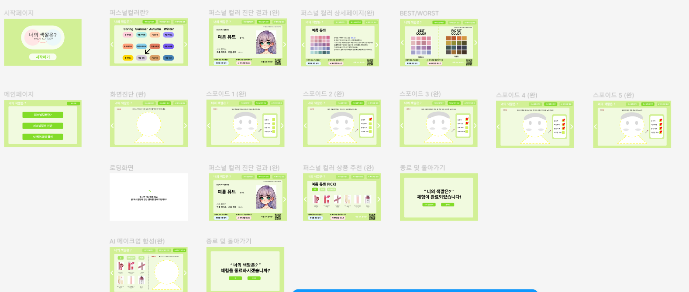
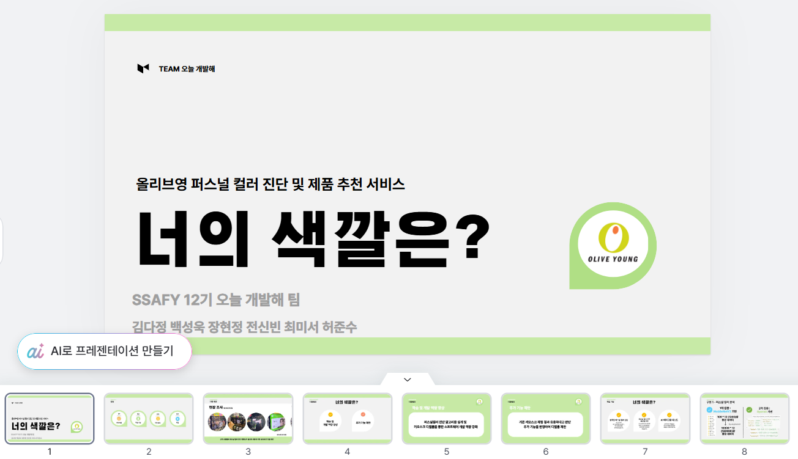

# TIL (Today I Learned)

> "매일 배운 것을 기록하며 성장하는 개발자 되기"  
> TIL은 개발자로서 매일 학습한 내용을 간단하게 정리하고 공유하기 위한 저장소입니다.

---

## 📚 목적
- 배운 내용을 체계적으로 정리하고 기록.
- 학습 내용을 복습하며 장기 기억으로 정착.
- 다른 개발자와 지식을 공유하여 성장에 기여.

---

## 📌 규칙
1. **매일 작성**: 하루에 한 가지 이상 학습 내용을 기록합니다.
2. **간결하게 작성**: 핵심만 요약하되, 필요한 경우 자세한 설명을 추가합니다.
3. **카테고리별 정리**: 주제별 폴더와 파일로 구분하여 관리합니다.
4. **예제 코드 포함**: 가능하면 코드와 함께 작성하여 이해를 돕습니다.

---

# <Title>

## 📖 오늘 배운 내용
- **핵심 요약**: 배운 내용을 간단히 요약합니다.
- **상세 설명**: 필요한 경우 자세히 기록합니다.
- **예제 코드**: 배운 내용을 코드로 정리합니다.

---

## 🔗 참고 자료
- [링크 1](https://example.com)
- [링크 2](https://example.com)

2025.01.22
올리브영 제출할 ppt 완성
figma 작성 완료, 시연 영상 촬영
올리브영에 메일 발송 완료

2025.01.23
발표용 ppt 작업
프로젝트 명세서, 기능 명세서 작성 및 확인
연휴 및 앞으로의 계획 수립
