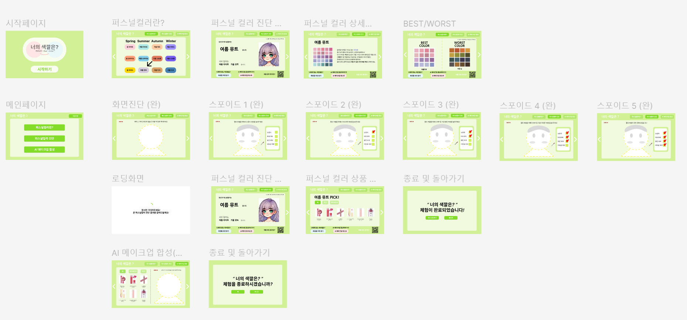
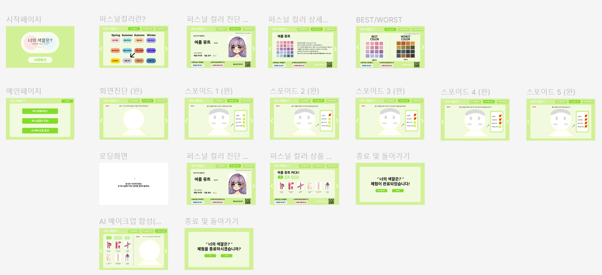

# TIL (Today I Learned)

> "매일 배운 것을 기록하며 성장하는 개발자 되기"  
> TIL은 개발자로서 매일 학습한 내용을 간단하게 정리하고 공유하기 위한 저장소입니다.

---

## 📚 목적
- 배운 내용을 체계적으로 정리하고 기록.
- 학습 내용을 복습하며 장기 기억으로 정착.
- 다른 개발자와 지식을 공유하여 성장에 기여.

---

## 📌 규칙
1. **매일 작성**: 하루에 한 가지 이상 학습 내용을 기록합니다.
2. **간결하게 작성**: 핵심만 요약하되, 필요한 경우 자세한 설명을 추가합니다.
3. **카테고리별 정리**: 주제별 폴더와 파일로 구분하여 관리합니다.
4. **예제 코드 포함**: 가능하면 코드와 함께 작성하여 이해를 돕습니다.


## 📖 오늘 배운 내용
- **핵심 요약**: 배운 내용을 간단히 요약합니다.
- **상세 설명**: 필요한 경우 자세히 기록합니다.
- **예제 코드**: 배운 내용을 코드로 정리합니다.

---

## 🔗 참고 자료
- [링크 1](https://example.com)
- [링크 2](https://example.com)

## 1월 20일 프론트 피그마 작업


## 1월 21일 프론트 피그마 2차


## 1월 22일 프론트 피그마 완성


## 1월 23일
PPT 와 발표준비중

## 1월 27일
tailwind css와 daisy ui를 혼합해서 한번 시도할 예정.
피그마에서 css를 추출할 수 있을 것 같은데, 더 알아봐야함
퍼스널컬러 캐릭터 2개 생성 (가을뮤트, 여름 라이트)
[재사용 가능한 버튼 만들기](https://velog.io/@mrbartrns/%EC%9E%AC%EC%82%AC%EC%9A%A9-%EA%B0%80%EB%8A%A5%ED%95%9C-%EB%B2%84%ED%8A%BC-%EC%BB%B4%ED%8F%AC%EB%84%8C%ED%8A%B8-%EB%A7%8C%EB%93%A4%EA%B8%B0-React)
[daisy ui랑 tailwind css 활용](https://velog.io/@rmc2/React-Tailwind-CSS-Daisy-UI%EB%A1%9C-%EB%8B%A4%ED%81%AC%EB%AA%A8%EB%93%9C-%EB%A7%8C%EB%93%A4%EA%B8%B0)
[프론트엔드 코딩 컨벤션](https://velog.io/@kangactor123/frontend-coding-convention)

이후에 할 것: 프론트엔드 코드 규약 정하기 & tailwind, daisy ui 설치 후 config에 추가하기

## 1월 28일
tailwind 사용법을 숙지하지못함.. 설치를 했는데 왜 사용을 모태...
일단 냅다 상단바랑 기본 배경 만듦
세팅 때 push한 backgroundpage 철자도 틀리고 하여튼 새로만들어서 이거지워야함
css파일을 components마다 만드는게 맞나?
일단 냅다 다 만들고 한 파일에 옮기던지 해야할듯
이젠정말 usestate useref 를 공부해야해..
route와 router 차이점... props가 뭐지

### Link 컴포넌트와 useNavigate의 차이점
#### Link 컴포넌트
- React-Router-Dom 이 제공하는 컴포넌트이다.
- Link 컴포넌트로 만든 부분을 누르면 URL경로가 바뀌면서 해당 경로로 지정된 컴포넌트가 보여진다.
- 클릭만 하면 이동하기 때문에 다른 연산과정 없이 페이지를 이동할 때 쓰인다. (조건 없이)
- 개발자 도구에는 a태그그 로 보인다.

- 그렇다면, Link 컴포넌트와 a태그의 차이점은?
    - a태그는 전체 페이지를 재렌더링 시킨다. 브라우저 주소를 이동하고 페이지 자체를 새로고침한다. 따라서 상태 값이 유지되지 못하고 속도도 저하된다.
    - link 는 SPA의 특징에 맞게 필요한 부분만 재렌더링하고 나머지 부분은 그대로 유지된다. 데이터를 필요한 부분만 불러올 수 있기 때문에 속도향상에 도움이된다.
    - 쓰임의 차이
        - a태그 는 외부 프로젝트와 연결 할 때 주로 사용한다.
        - link 는 프로젝트 내에서 페이지 전환하는 경우 사용한다.

#### useNavigate hook
1. useNavigate 훅을 실행하면 페이지 이동을 할 수 있게 해주는 함수를
반환한다.
    - 반환하는 함수를 navigate라는 변수에 저장 후 navigate의 인자로  설정한 path값을 넘겨주면 해당 경로로 이동할 수 있다.
2. 조건이 필요한 곳에서 navigate 함수를 호출해서 경로를 이동할 수 있다.
    - ex. 로그인 페이지에서 아이디와 비밀번호를 입력하고 로그인 버튼을 클릭했을 때 다른 페이지로 이동할 때

>💡useNavigate를 직접 호출하지 않고 변수로 선언해서 반환된 함수를 호출하는 이유는?
```
import { useNavigate } from "react-router-dom";
const Login = () => {
    const navigate = useNavigate();
    return(
      <div className="login">	
	    <input placeholder="전화번호, 사용자 이름 또는 이메일"/>
        <input placeholder="비밀번호/>
        <button onClick={() => {navigate("/main");}}>로그인</button>                   
      </div>
	)
  }
```
> hook의 규칙
- 컴포넌트 최상단에서만 호출해야한다.
- 다른 조건문, 함수선언문, 반복문 등 중첩된 함수 안에서는 호출 할 수 없다.
- 컴포넌트 내부 함수에서 callback으로도 호출 할 수 없다.
- 함수 컴포넌트에서 호출할 수 있다. (Custom hook에서 예외처리 가능)

#### Link 컴포넌트와 useNavigate hook의 차이
1. Link
클릭 시 바로 이동하는 로직 구현 시에 사용
ex) 상품 리스트에서 상세 페이지 이동 시
2. useNavigate
페이지 전환 시 추가로 처리해야 하는 로직이 있을 경우 useNavigate 사용
ex) 로그인 버튼 클릭 시
회원가입 되어 있는 사용자 -> Main 페이지로 이동
회원가입이 되어 있지 않은 사용자 -> SignUp 페이지로 이동